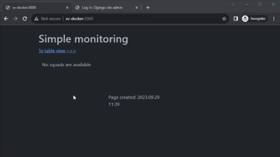
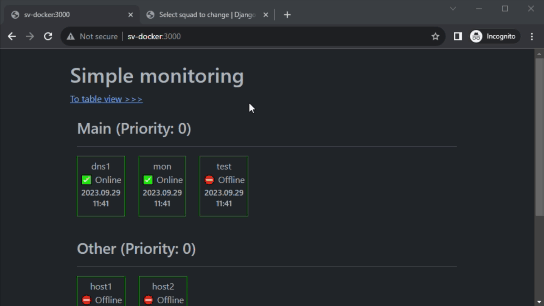
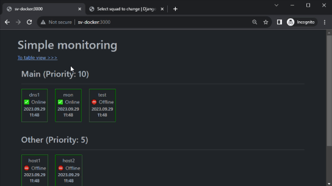
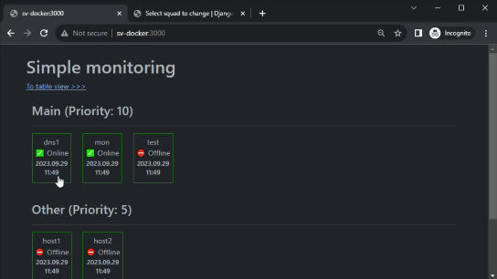
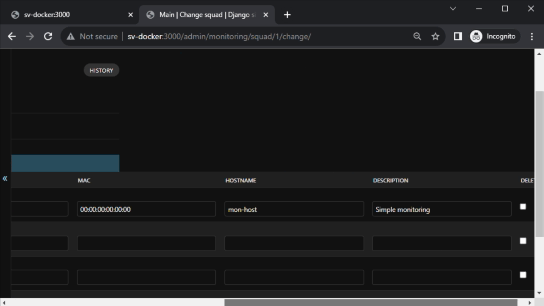

# simple-monitoring-site

Monitor your devices by icmp echo (ping) grouped by squads.

### Installation

* Update Django secret key, database password, superadmin password and time zone in `.env` file:
```
SECRET_KEY=secret_key
DB_PASSWORD=123456
SUPERUSER_PASSWORD=admin
TIME_ZONE=Asia/Yekaterinburg
```

* Create and run app:
```
make docker-create
```

* Restart app:
```
make docker-restart
```

* Get help:
```
make help
```

Go to http://localhost:3000/admin and create your squads with devices

Go to http://localhost:3000/ to view devices ordered by squads

Go to http://localhost:3000/table to view devices in table format

### Review

- Add devices grouped by squads:

  

- Set priority to change squads order in views:

  

- Switch between card and table views:

  

- View detail information about device:

  

- Fill detail information about devices:

  

